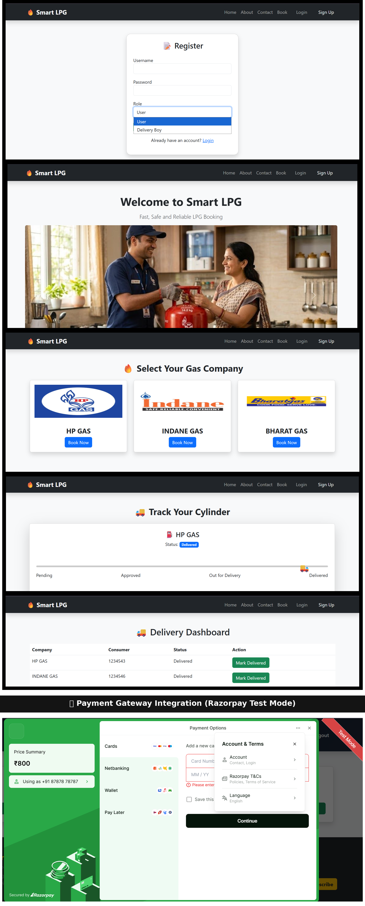

# 🔥 Smart LPG Management System

A Django-based web application for LPG cylinder booking and delivery tracking.

## 🚀 Features

- User Registration & Login
- Role-based Authentication (User & Delivery)
- LPG Cylinder Booking
- Real-time Delivery Status Tracking
- Delivery Dashboard for Agents

## 🛠️ Tech Stack

- Python (Django)
- HTML, CSS, Bootstrap
- SQLite Database

## 🚀 Project Preview

> **Complete Flow:**  
> **Register → Login → Select Gas Company → Enter Consumer Details → Book Cylinder → Razorpay Payment → Booking Confirmation → Track Cylinder Status → Delivery Dashboard → Order Delivered**

<p align="center">
  
</p>

## ⚙️ Installation

```bash
git clone https://github.com/aryank77/smart-lpg-management-system.git

cd smart-lpg-management-system

pip install -r requirements.txt

python manage.py runserver